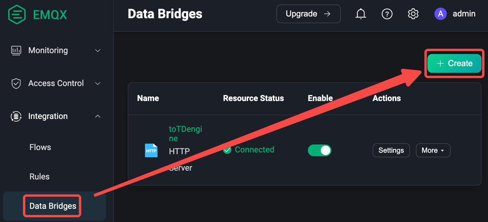
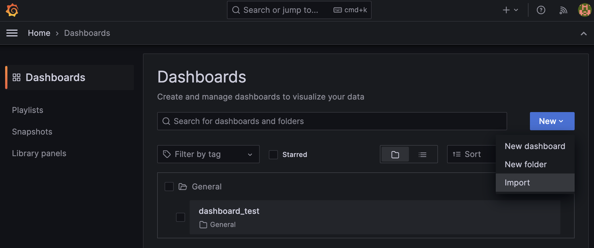

## Quick Start
bring up a local TDengine DB, build and start the service
```shell
cd tools
docker-compose up -d 
```
## Configuration
### 1. Create TDengine Database and Table
In this step we create the appropriate database and table schema in TDengine for receiving MQTT data. 
First open Docker Terminal

Then create database by TDengine terminal:

```shell
# taos
taos>
```
Copy and paste below SQL script to taos
```SQL
CREATE DATABASE test;
USE test;
CREATE TABLE sensor_data (ts TIMESTAMP, temperature FLOAT, humidity FLOAT, volume FLOAT, pm10 FLOAT, pm25 FLOAT, so2 FLOAT, no2 FLOAT, co FLOAT, sensor_id NCHAR(255), area TINYINT, coll_time TIMESTAMP);
```
### 2. Create EMQX Integration to TDengine Rule
#### 2.1 Login EMQX Dashboard
Use your browser to open the URL http://192.168.31.98:18083 (remember to change your IP here, and cannot use localhost or 127.0.0.1) and log in to EMQX Dashboard. Initial installation username: admin, password: public

#### 2.2 Create Data Bridges
Choose "Data Bridges" -> Click "Create" -> Choose "HTTP Servers" -> Configuration:

in next page, enter below information:  
```http request
Name: Your name of the bridge, for example, "toTDengine"  
Method: POST  
URL: http://192.168.31.98:9041//rest/sql, remember to change your IP here
Key: Authorization          Value: Basic cm9vdDp0YW9zZGF0YQ==
Query Mode: Async
```
Body Enter:
```SQL
INSERT INTO test.sensor_data VALUES(
  now,
  ${payload.temperature},
  ${payload.humidity},
  ${payload.volume},
  ${payload.PM10},
  ${payload.pm25},
  ${payload.SO2},
  ${payload.NO2},
  ${payload.CO},
  '${payload.id}',
  ${payload.area},
  ${payload.ts}
)
```
Then click "Test Connectivity" to make sure config is correct and click "Create" button to create the data bridge  
#### 2.3 Create Rule To Integration to TDengine
Choose "Rules" -> Click "Create":

in next page, enter below SQL:
```SQL
SELECT
  payload
FROM
  "sensor/data"
```
then click "Add Action" -> choose "Forwarding with Data Bridge" -> choose "webhook", to the data bridge you created in last step


### 3. use mock simulator to create mock data to EMQX broker
pull this project to your local:
```shell
git clone https://github.com/freezonex/TDengine
```
enter mock script folder and run mock.js
```shell
cd docs/examples/other
node mock.js
hongzhi@hongzhis-MacBook-Air other % node mock.js    
client mock_client_0 connected
client mock_client_1 connected
client mock_client_2 connected
client mock_client_3 connected
client mock_client_4 connected
client mock_client_5 connected
client mock_client_6 connected
client mock_client_7 connected
client mock_client_8 connected
client mock_client_9 connected
10:26:33 PM send success.
```
then check EMQX broker rule dashboard and TDengine database, to check if dataflow work successfully.

### 4. Grafana Dashboard
In this step we should a demo dashboard to show the data from TDengine  
First open http://localhost:3000 grafana dashboard, default username: admin, password: admin  
Then import dashboard script:

choose script/dashboard_test.json file to import:

also can set to dynamic refresh for demo purpose:

## If develop in mainland China, need add use domestic mirror:
```shell
$ go env -w GOPROXY=https://mirrors.aliyun.com/goproxy/,direct
$ go env | grep GOPROXY
```

## Setup Graphana
Install Graphana on your local system. To sign in to Graphana for the first time:
1. Go to http://localhost:3000/ (Change the actual port number base on the docker configuration)
2. On the sign in page enter the following  
*Username: admin*    
*Password: admin*  
If successful, you can see a prompt and change your password on that prompt.
## Integrate Graphana with TDengine
Install TDengine plugin using either **GUI** in the Graphana plugin catalog or using **script**:
```
bash -c "$(curl -fsSL \
  https://raw.githubusercontent.com/taosdata/grafanaplugin/master/install.sh)" -- \
  -a http://localhost:6041 \
  -u root \
  -p taosdata
```
If you are using GUI, after install the TDengine plugin:  
Add a new datasource of TDengine inside the `connections` pannel. Configure the Host, User, and password accordingly to make it work.

